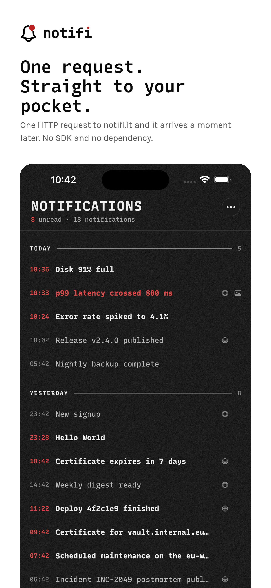
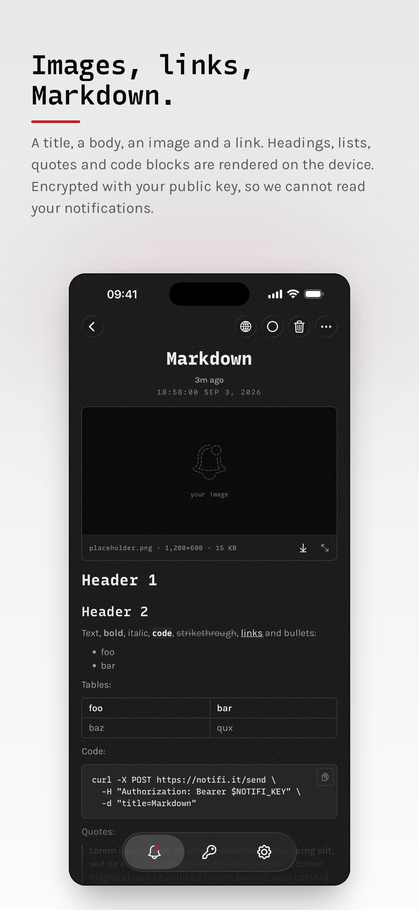
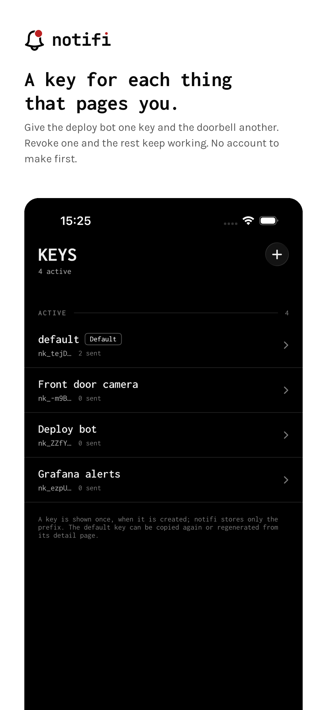

<p align="center">
  
</p>

<p align="center"><b>Push notifications for people who live in a terminal.</b></p>

Create a send key, `curl` a title and message to `notifi.it/send`, and the alert
lands on your iPhone and Mac.

```bash
curl "https://notifi.it/send?key=nk_…&title=hello+world"
```

No accounts. No sign-in. No device linking. The device holds the only private key,
message content is sealed to that key at ingest so the server cannot read it, and
each message is deleted once the device acknowledges it. It is a relay, not a
mailbox.

The backend is a single Cloudflare Worker over a D1 database; the app is a
zero-dependency SwiftUI client for iOS 17+ and macOS 14+.

<p align="center">
  
  
  
</p>

## Quickstart

```bash
pnpm install
make migrate     # apply migrations to the local dev D1
make dev         # wrangler dev — local Worker + local D1
```

## Layout

```
apps/
  app/        Xcode project (iOS + macOS + two NSE targets)
  api/        Cloudflare Worker (Hono, TypeScript) — @notifi/api
packages/
  contract/   Zod schemas, the single source of truth — @notifi/contract
```

This project has **no automated tests and no code comments** by decision —
verification is by hand.
