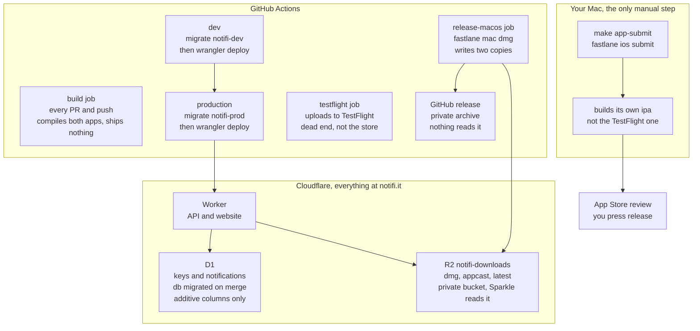

# How things ship

Three places do the work: GitHub Actions runs it, Cloudflare hosts what is
running, and one step happens on a Mac by hand.

## Merge to main deploys the server

Any merge touching `apps/api/**` or `packages/contract/**` runs
[api.yml](../.github/workflows/api.yml): migrations first, then the Worker, dev
then production. There is no approval gate on the `production` environment.

The website is not deployed separately. It is the static files in
`apps/api/public`, served by the same Worker, so a site edit ships on that same
merge.

Migrations run before the code that needs them, which is why a migration and the
code reading it can land in one PR.

## A `v*` tag ships the apps, never the server

By the time a tag is cut the schema has been live for a while. Apps only ever
catch up to it, and migrations are additive columns with defaults, so a user on
an older build keeps working.

The tag runs [app.yml](../.github/workflows/app.yml):

- iOS is archived and uploaded to TestFlight.
- macOS is built, notarized, and written to R2 by the fastlane `dmg` lane. The
  app's `SUFeedURL` is `https://notifi.it/download/appcast.xml`, so Sparkle
  reads R2 through the Worker.
- The same job also attaches the DMG and appcast to a GitHub release. The repo
  is private, so nothing can fetch those; they are an archive of what shipped.

## The App Store submission is not the TestFlight build

`make app-submit` runs `fastlane ios submit`, which builds a fresh IPA. Each
build stamps a new build number from the clock, so the binary submitted for
review is not the one testers received — same source, different artifact.

Approval does not publish. `automatic_release` is off, so the version waits in
"Pending Developer Release" until someone presses Release. That gate exists so
the store build and the Worker it talks to go live in an order a human chooses.

macOS is never submitted to the App Store.
