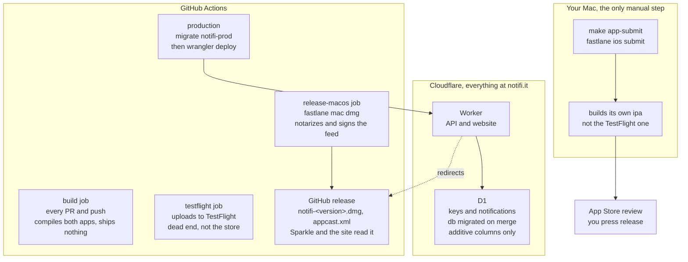

# How things ship

Three places do the work: GitHub Actions runs it, Cloudflare hosts what is
running, and one step happens on a Mac by hand.

## Merge to main deploys the server

Any merge touching `apps/api/**` or `packages/contract/**` runs
[api.yml](../.github/workflows/api.yml): migrations first, then the Worker.
There is one environment, and no approval gate on it.

The website is not deployed separately. It is the static files in
`apps/api/public`, served by the same Worker, so a site edit ships on that same
merge.

Migrations run before the code that needs them, which is why a migration and the
code reading it can land in one PR.

## A `v*` tag ships the apps, never the server

By the time a tag is cut the schema has been live for a while. Apps only ever
catch up to it, and migrations are additive columns with defaults, so a user on
an older build keeps working.

The tag runs [app.yml](../.github/workflows/app.yml):

- iOS is archived and uploaded to TestFlight.
- macOS is built and notarized by the fastlane `dmg` lane, then attached to a
  GitHub release as `notifi-<version>.dmg` and `appcast.xml`. The app's
  `SUFeedURL` is `https://notifi.it/download/appcast.xml` and the website links
  `/download/mac`; both are Worker redirects, so neither URL has to change on a
  release. `appcast.xml` keeps a fixed name and redirects straight to
  `releases/latest/download`; the DMG does not, so `/download/mac` reads the tag
  out of the `releases/latest` redirect first and falls back to the releases
  page if GitHub does not answer.

## The App Store submission is not the TestFlight build

`make app-submit` runs `fastlane ios submit`, which builds a fresh IPA. Each
build stamps a new build number from the clock, so the binary submitted for
review is not the one testers received — same source, different artifact.

Approval does not publish. `automatic_release` is off, so the version waits in
"Pending Developer Release" until someone presses Release. That gate exists so
the store build and the Worker it talks to go live in an order a human chooses.

macOS is never submitted to the App Store.

## iOS signs manually, from secrets

The iOS archive uses manual signing with an imported identity, not automatic
signing. Automatic signing mints a fresh Development certificate on every clean
runner and never removes one, and the account's certificate cap is what stops
the build once enough have piled up.

Four secrets carry it: `IOS_DISTRIBUTION_CERT_P12` and
`IOS_DISTRIBUTION_CERT_PASSWORD` for the Apple Distribution identity,
`IOS_APP_PROFILE_B64` and `IOS_NSE_PROFILE_B64` for the App Store profiles of
`it.notifi.notifi` and `it.notifi.notifi.nse` (both base64 of the
`.mobileprovision`). The profile *names* are read back out of the files, so
renaming one in the portal does not desync CI.

A local build needs none of this: `CODE_SIGN_STYLE`, `IOS_CODE_SIGN_IDENTITY`
and the two profile variables are unset, which is how Xcode spells automatic
signing. When a profile expires, replace the secret — CI will not renew it.
