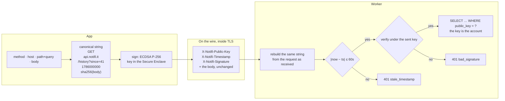
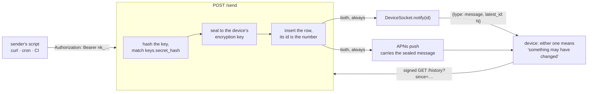
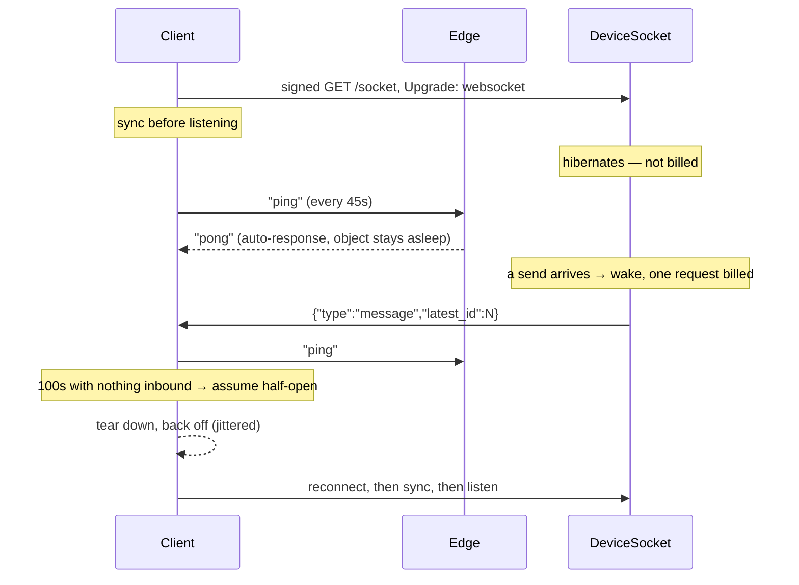

# Delivery

How a message gets from a sender's curl to a device's inbox, who is allowed
to ask for it, and why it cannot be lost or reordered on the way. The code
this describes: `apps/api/src/routes/send.ts`, `apps/api/src/socket.ts`,
`apps/api/src/routes/history.ts`, `apps/api/src/lib/signature.ts`,
`apps/api/src/middleware.ts`, `apps/app/Shared/Store/SyncEngine.swift`,
`apps/app/Shared/API/APIClient.swift`,
`apps/app/Shared/API/SocketClient.swift`.

## The invariant

No transport carries state the app trusts. A push, a socket frame, launch,
foregrounding and manual refresh are five ways of learning one thing —
something may have changed — and all five call the same `sync()`, which
fetches from `/history` and reconciles against the store.

Because nothing is trusted, there is no failover logic: no code checks
whether APNs is up before using it, and a dropped frame or duplicate push
costs one wasted fetch. The socket frame carries a `latest_id` for anyone
reading the wire; the client ignores it.

There is deliberately no periodic poll. It only covered the case where the
socket is blocked *and* APNs is broken at the same time, and opening the app
covers that. If that window turns out to matter, the place to add a timer
back is `AppModel.startLiveUpdates`.

## Who a request is from

There is no login, no session and no token to issue or expire. There are
two unrelated secrets, pointing in opposite directions, and conflating them
is the usual first mistake.

The **device key** is a P-256 signing key created on first launch and held
in the Secure Enclave, so it never leaves the device — on the Simulator,
which has no enclave, a software key stands in. Its *public* half is the
account: `devices` is keyed by it, and every row the app can reach hangs
off that one lookup. It authorises `/devices`, `/keys`, `/history` and
`/socket`.

The **send key** is a bearer string, `nk_` and 32 random bytes, and it
authorises exactly one thing: `POST /send` to the device that minted it.
The server stores only `SHA-256` of it, plus a four-character prefix to
show in the key list; a send hashes what it was given and looks for a
match. It cannot read the inbox, list keys or mint more keys, which is the
whole point — a send key travels in shell history, CI logs and other
people's config files, and the device key travels nowhere.

The two are not alternatives. The signature is what proves you may *manage*
send keys — `/keys` is signature-authenticated like everything else — and
the send key is what a script uses afterwards. Every key row carries the
`device_id` it was minted under, and a send joins straight back to it
(`FROM keys k JOIN devices d ON d.id = k.device_id`), which is why a send
carries no addressing information: the destination is the row.

### One signing key per device means one account per device

A device makes its keypair on first launch, so an iPhone and a Mac are two
`devices` rows and two unrelated sets of send keys. A key minted on the Mac
pages the Mac, does not appear in the iPhone's key list, and cannot be
revoked from it; `MAX_ACTIVE_KEYS` is five each rather than five between
them.

That falls out of having no accounts and no device linking (ruled out in
[PLAN.md](PLAN.md)). There is nothing above a device for a key to belong
to, so "all your keys" does not exist server-side — only "all this device's
keys". A script that should reach both screens needs a key from each and
sends to both.

A third key, P-256 for key agreement rather than signing, only receives:
the server seals each message to it with HPKE. It lives in a keychain
group shared with the notification service extension, while the signing key
and the default send key sit in an app-only group the extension does not
list. The extension parses an attacker-chosen payload and downloads an
attacker-chosen image, so a foothold there should reach the one key needed
to unseal a push and no further.

### Signing

The app signs a canonical description of the request it is about to make,
and `verifyDeviceSignature` rebuilds that description from the request the
Worker actually received:

```
METHOD \n host \n path?query \n timestamp \n sha256hex(body)
```



Three headers carry the result — `X-Notifi-Public-Key`,
`X-Notifi-Timestamp`, `X-Notifi-Signature` — and if the signature verifies
under the key in the first of them, the request came from whoever holds
that private key. Because host, path, query and body are all inside the
signed string, a captured request cannot be pointed at another endpoint or
have its query string edited in flight.

`Accept-Language` is deliberately *outside* it. It changes the wording of a
reply and never what the request does, so it is the one header free to
vary.

### The 60-second window is the whole replay defence

A signature more than `REPLAY_WINDOW_S` from the server clock is rejected
with `stale_timestamp`. Nothing remembers which signatures have been seen:
that table existed and was removed. Exploiting its absence needs a copy of
a request that travels inside TLS, and the only non-idempotent thing a
replay could do was mint a duplicate key — which shows up in the key list
and can be revoked. A D1 write on every mutation was not worth insuring
against an attacker who can already read your TLS traffic.

A device with a wrong clock recovers on its own: a `stale_timestamp` reply
makes the client adopt the response's `Date` header as an offset and
re-sign once. The offset is capped at 24 hours, because anything able to
set that header could otherwise make the client mint validly signed
requests bearing a chosen future timestamp and harvest them.

### What is deliberately not checked

Registration. `POST /devices` asserts a public key and whoever signs for it
owns that row from then on; there is nothing to verify it against, because
there is nothing to have an account with. The per-IP limiter and a ceiling
of five active keys per device are all that bound how many rows one party
can create. That is the trade for having no sign-up, and it is the first
thing to revisit if abuse appears.

## The bookmark

Every message has an id that only ever goes up (`messages.id`, one counter
for the whole table). The app stores one number — the highest id it has saved
— and every sync asks for everything above it, saves what comes back, then
moves it up.

The bookmark is also the receipt: `/history` treats the `since` it is given
as an acknowledgement, and the server blanks the content of every row at or
below it and stamps `collected_at`. So
the bookmark must never get ahead of the store, and `SyncEngine.sync()`
moves it only after `context.save()` returns. A crash between the two
leaves the bookmark behind, which refetches and dedupes — the safe
direction.

Gaps in the numbering are normal (every other device's messages sit in
between), so the client never infers a missing message from a hole.

## What a send does

`POST /send` checks the key, seals the message to the device's encryption
key, and shrinks the push payload until it fits the APNs budget: full
message, then a truncated preview, then title only. The copy in D1 never
shrinks.

The write is one `INSERT … SELECT … WHERE` with the two limits as its
conditions: fewer than 60 rows for the device created in the last hour, and
fewer than 500 rows for the device with no `collected_at`. Both are counts
over `messages`, which is the only record of either fact — a collected row
keeps its `created_at` for the hour, with its content blanked, so the send
still counts. Nothing on `devices` is bumped, and the statement is atomic, so
two sends racing at 499 cannot both land. The row's id is its number: the
insert returns it, so a number exists only once its row does.

When the insert is refused, one follow-up read says which limit it was. Over
the uncollected ceiling the send answers `507 too_many_uncollected`, with no
`Retry-After` — the count falls when the device collects, not on a timer —
and logs `send.uncollected_limit`, which the console capture in
`lib/report.ts` sends to Sentry as one event per refused send, fingerprinted
onto a single issue. Over the hourly limit it answers `429 rate_limited`, with
`Retry-After` counted from the oldest send still inside the hour.

After the write, two transports fire, in parallel, unconditionally:

- **APNs push** — carries the sealed message, because a locked phone must be
  able to show a banner with the app closed. May be all the user ever sees.
- **Socket frame** — `{"type":"message","latest_id":N}`, nothing else. It
  reaches a running app, which fetches anyway.

Neither waits for the other; a failure in either cannot fail the send. A
device holding both gets the message twice and dedupes on the id.



## The socket

### The upgrade is an ordinary signed GET

A websocket handshake is a GET with an `Upgrade` header, and this treats it
as exactly that: `/socket` runs the same `signatureAuth` as `/history`,
over the same canonical string with the same empty-body hash. The client
builds a normal signed request and swaps the scheme to `wss` afterwards —
the scheme is not in the signed string, so the signature survives it.

No ticket endpoint, no token in the query string, no cookie. Those exist
elsewhere because browsers cannot set headers on `WebSocket`; a native
client can, so none of that machinery is needed.

Once the signature resolves to a device row, the Worker derives the object
name from the row id — `idFromName(String(device.id))` — and hands the
upgrade over. Names are derived, never stored, so there is no mapping table
to keep in step and the send path can address the same object knowing only
the device id it already has.

### Hibernation is the cost model

`ctx.acceptWebSocket()`, not `server.accept()`: the latter pins the object
in memory for the life of the connection, which for an always-on menu bar
app means paying duration around the clock.

Keepalives would undo that immediately, because any frame reaching a
handler wakes the object and bills a request — a ping every 30s costs
precisely what polling costs. So the object registers a
`WebSocketRequestResponsePair('ping', 'pong')` and the edge answers
keepalives without waking anything. That pair is why the client sends a
text `"ping"` rather than a protocol ping frame: it has to match literally.
Only a real send wakes the object.



Nothing the client says is acted on. The device drives everything through
signed HTTP, so `webSocketMessage` is empty and anything arriving there is
either a keepalive that missed the auto-response or a client that should
not be sending.

### The watchdog

A socket TCP has dropped without telling either end — an expired NAT entry,
a Wi-Fi handoff, a proxy closing an idle connection — looks exactly like a
quiet one: nothing arrives, no error is raised. Without a heartbeat the app
would sit on a dead socket believing it was live until something forced a
relaunch.

So the client pings every 45s, because the idle timeouts that cause this
are commonly 60, and gives up after 100s of silence, because one missed
pong is a slow network and two is a socket that is not coming back. It
tears the connection down and reconnects with exponential backoff and
jitter — without the jitter an APNs-scale outage would reconnect every
device on the same second, which is the moment the server can least afford
it.

Every reconnect syncs *before* listening, because whatever arrived while
the socket was down was never announced — on a laptop that gap is every lid
close.

### Connectivity has four states, not two

`SocketClient.State` is the app's only live connectivity signal: the Mac
menu bar strikes the bell through, the Inbox says it cannot reach notifi.
It is `idle` / `connecting` / `connected` / `failed`, and only `failed`
reports an outage.

Two states rather than a Bool for "not connected", because a socket that
has been asked for and has not answered yet is not an outage. On iOS the
connection is torn down on background, so every foreground starts there and
runs a full `/history` sync before it counts as open; reporting that as
offline showed the banner, and an error haptic, on essentially every
launch. Retries stay in `failed` for the mirror-image reason — once
connectivity is known to be broken, the reader should not watch the banner
blink off once per attempt.

## `is_critical`

Whether a send was actually delivered as an escalated alert — the sender
asked (`is_critical=1`, or the older `critical=1`, both honoured) and the
key had the standing — is resolved before sealing and written into the
sealed content on every message, false included. Absent means the message
predates the field. The sender's request is not stored; only the outcome.

A send that asks and does not have the standing still delivers, and its
`202` carries a `warning` string. That is the only signal the sender gets:
the request succeeded, so a script watching the status code sees nothing,
and a key switched off months ago would otherwise page quietly forever.

## Deletion

The server is a relay, not an archive; the device's store is the only
lasting copy. Collecting a message blanks its content on the spot; the row
stays with no content, so the hourly limit can count it. A cron sweep (daily,
04:00 UTC) deletes collected rows once their hour is up, and uncollected rows
past `expires_at` — 90 days after the send, the retention the privacy policy
promises. Until then an uncollected message waits, encrypted, for as long as
its device takes to come back, and a device stays registered until its owner
deletes the app's data.

Deleting a message in the app is local: there is no server call to make,
and the row cannot come back because `/history` only returns rows above
the bookmark. An unreadable row holds the ack at the last good message so
the sweep keeps it for a retry.

## What covers what

| Condition | Covered by | Delay |
|---|---|---|
| Device asleep, app closed | APNs | instant |
| Token signed for the wrong APNs environment | socket | instant |
| APNs incident | socket | instant |
| Socket blocked by a proxy or captive portal | APNs | instant |
| Socket blocked and APNs broken at once | launch, foreground, refresh | when the app opens |
| Socket half-open after a NAT timeout | client watchdog, then socket | ≤ 100s |
| Worker evicted before the frame was sent | APNs, which fires separately | instant |
| Sent while the device was offline | sync on reconnect | on reconnect |
| Store save failed mid-sync | bookmark holds, refetched | next sync |
| A row will not decrypt | ack holds, server keeps the row | next sync |

The app counts messages that arrive with no push behind them; three in a
row shows a "Delivery — not pushing" warning in Settings, and one good
push clears it. That is how a wrong-environment APNs token surfaces
instead of failing silently.

## Why sockets and not polling

Polling costs scale with time × devices; sockets scale with messages ×
devices, and for a pager messages are far rarer than seconds. At 10,000
devices, a 30s poll costs roughly $260/month in Worker requests (about
$1,900 before the idle D1 writes were removed); the socket costs roughly
$5–10, dominated by reconnects. Published rates against an assumed traffic
model, not a bill.

## Verifying

`make typecheck` plus both `xcodebuild` schemes, then
by hand. The transactional send and the
socket path can be exercised locally against `wrangler dev` (loopback is
exempt from the HTTPS redirect for exactly this): register a device, open
`/socket`, send, and the frame arrives before any fetch is due.

The signing side is easiest to check by breaking it deliberately. Change
one character of the path after signing and the reply is `401
bad_signature`; hold a signed request for more than a minute and it is
`401 stale_timestamp`, then succeeds on the client's one retry.
